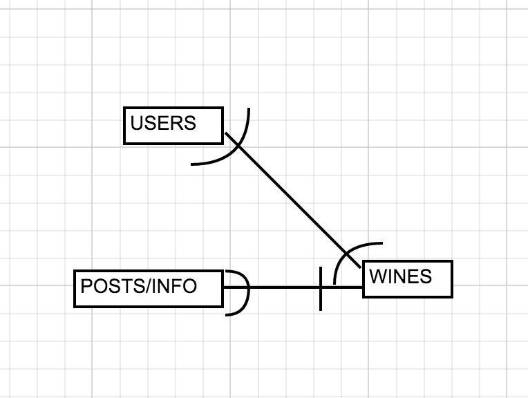
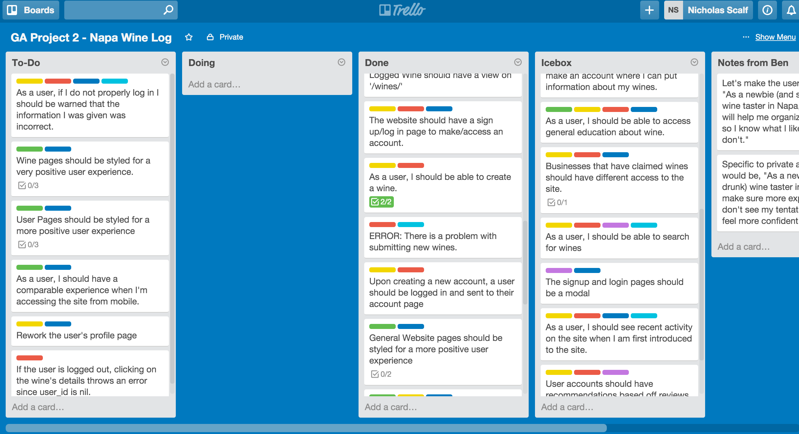
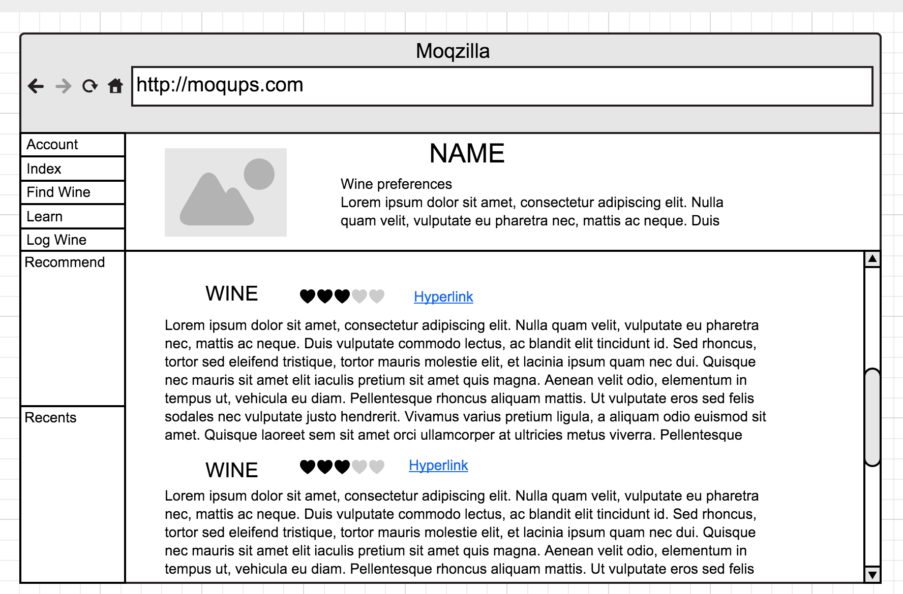
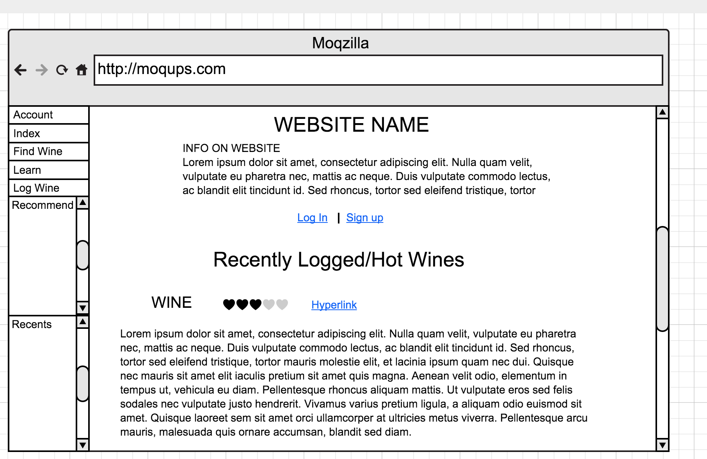
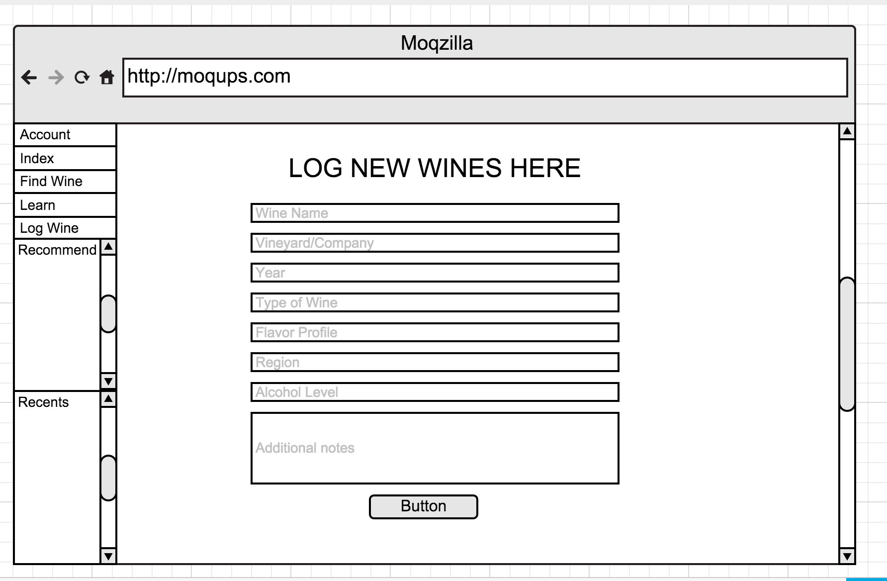

# Drunk Grasshopper

# Description
Drunk grasshopper is a site for want to be wine enthusiasts.  In practice, it works a lot like a small scale wine log to keep notes on what you drink as you explore new wines.  As the project builds out, it will become more clear that there is a focus on Napa Valley Wines.  

# Technologies Used
Technologies used include HTML5/CSS3, jQuery, Sass-Rails 5.0, Ruby 2.2.0, Rails 4.2.5.1, Paperclip 4.3.5 and PostgreSQL 9.5.0. 

Photos pulled from Unsplash.com

# How to Contribute

Contributions are welcome! Fork this repository, make your changes and submit any and all pull requests.

# Planning Stage
The Models:

The Trello Board:
https://trello.com/b/H3XIfhbT/ga-project-2-napa-wine-log

The Wireframes:

